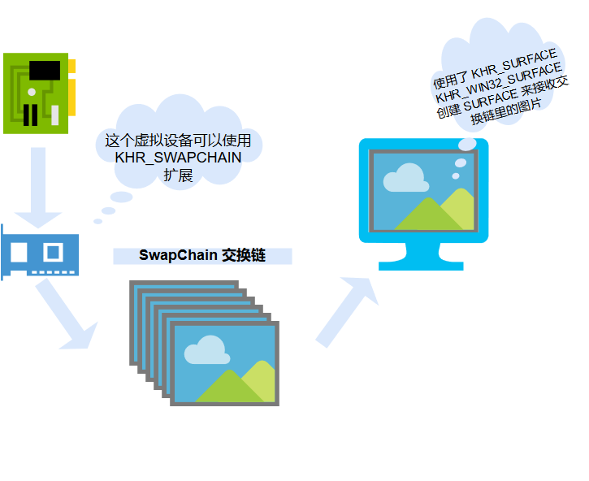

# 创建个交换链出来

首先,各位有可能对交换链的概念没有理解或者理解的不是特别的透彻,简单说交换链就是一个公交车,公交车里的乘客就是一个帧,作用呢就是万一显卡没跟上,或者显卡太快了,让用户感觉画面没有什么实质性的变化的一个工具,交换链的发明使得用户体验上没有那么多的卡顿.



```rust
//swapchain 是我们的交换链 extent是交换链的大小 backbuffer 是一个缓冲 format是格式 frames_in_flight可以理解为正在传输中的帧吧
let (swapchain, extent, backbuffer, format, frames_in_flight) = {
            let (caps, preferred_formats, present_modes) =
                surface.compatibility(&adapter.physical_device);
            info!("{:?}", caps);
            info!("首选格式: {:?}", preferred_formats);
            info!("当前模式: {:?}", present_modes);

            let present_mode = {
                use gfx_hal::window::PresentMode::*;
                [Mailbox, Fifo, Relaxed, Immediate] //这是几种GPU中常见的模式 Mailbox就是邮箱一样的,FIFO就是first in first out 感兴趣的可以百度
                    .iter()
                    .cloned()
                    .find(|pm| present_modes.contains(pm))
                    .ok_or("没有设置任何当前模式")?
            };

            let format = match preferred_formats {
                None => Format::Rgba8Srgb,
                Some(formats) => match formats
                    .iter()
                    .find(|format| format.base_format().1 == ChannelType::Srgb)
                    .cloned()
                {
                    Some(srgb_format) => srgb_format,
                    None => formats.get(0).cloned().ok_or("没有任何首选格式")?,
                },
            };
            let extent = caps.extents.end().clone();
            let image_count = if present_mode == PresentMode::Mailbox {
                (caps.image_count.end - 1).min(3)
            } else {
                (caps.image_count.end - 1).min(2)
            };
            let image_usage = if caps.usage.contains(Usage::COLOR_ATTACHMENT) { //如果这个设备没有彩色支持的话,天啊!!!
                Usage::COLOR_ATTACHMENT
            } else {
                Err("天哪!都9086年了你居然还在用单色屏幕??!!")?
            };
            let mut swapchain_config =
                SwapchainConfig::new(extent.width, extent.height, format, image_count);
            swapchain_config.present_mode = present_mode;
            swapchain_config.image_usage = image_usage;

            info!("{:?}", swapchain_config);
            // 创建交换链和一个(图像)缓冲区
            let (swapchain, backbuffer) = unsafe {
                device
                    .create_swapchain(&mut surface, swapchain_config, None)
                    .map_err(|_| "创建交换链失败")?
            };

            (swapchain, extent, backbuffer, format, image_count as usize)
        };
```